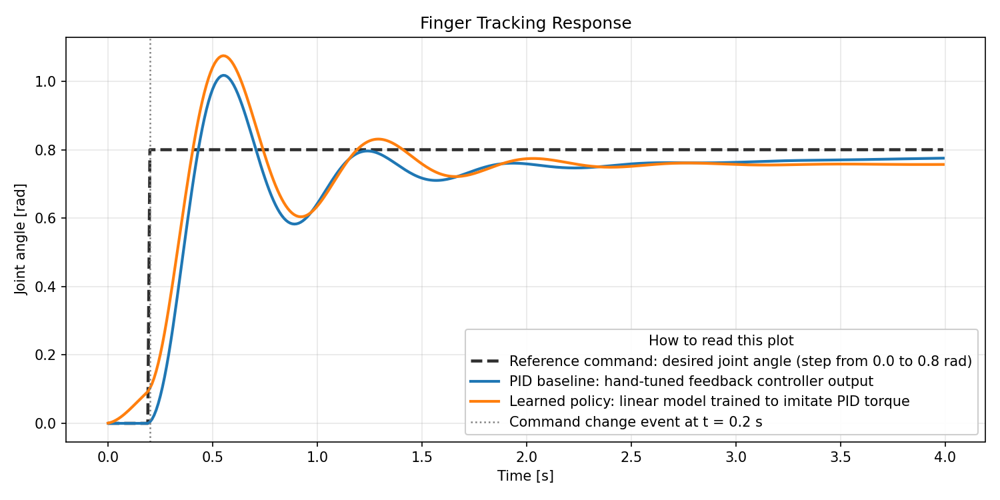
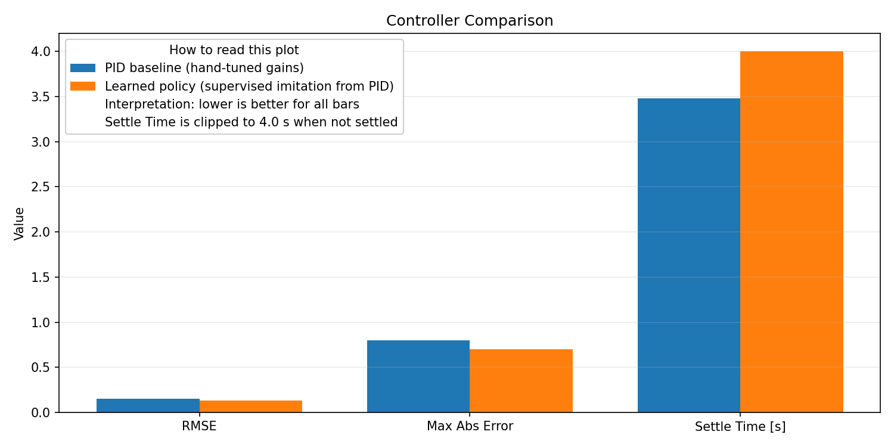

# Humanoid Hand Control Lab

Simulation and control mini-stack for a humanoid robot finger.

This portfolio project is designed for **Software Engineer, Humanoid Robotics** roles and demonstrates:
- control-system architecture
- classical feedback control (PID)
- data-driven control policy (learned linear policy)
- evaluation with metrics, tests, and CI
- extension path to ROS2/C++

## Highlights

### Closed-loop tracking behavior


### Controller quality comparison


## What is implemented

- Dynamic plant model: `src/hand_control/model.py`
- PID controller: `src/hand_control/controllers.py`
- Learned policy (supervised imitation from PID trajectories): `src/hand_control/learner.py`
- Simulation engine and metrics: `src/hand_control/simulator.py`, `src/hand_control/metrics.py`
- Demo and benchmark scripts: `scripts/run_demo.py`, `scripts/benchmark.py`
- Plot generation script: `scripts/generate_plots.py`
- ROS2 C++ integration sketch: `ros2/finger_controller_node.cpp`

## Quickstart

```bash
python -m venv .venv
.venv\Scripts\activate
pip install -e .
pip install pytest
pytest -q
python scripts/run_demo.py
python scripts/benchmark.py
```

To regenerate plots:
```bash
pip install -e .[viz]
python scripts/generate_plots.py
```

## Results snapshot

- Test suite: `4 passed`
- PID tracking RMSE (step target): about `0.149`
- Learned policy RMSE: about `0.133`
- Benchmark runtime: around `3 microseconds` per simulation step

## What I Learned

This project was built to learn how a compact robotics control stack is structured end-to-end.

Goals:
- build a clean separation between physics model, controllers, simulation loop, and metrics
- implement and tune a classical controller (PID) for joint-angle tracking
- add a simple data-driven controller and compare it against a model-based baseline
- produce reproducible evidence with tests, benchmark numbers, and visual plots

Results achieved:
- implemented a full closed-loop simulation workflow for a 1-DOF humanoid finger joint
- validated functionality with automated tests (`4 passed`)
- compared controller quality using RMSE, max error, and settling behavior
- generated explainable visual artifacts for fast reviewer understanding
- prepared a clear extension path toward ROS2/C++ integration

## Relevance to Humanoid Robotics Engineering

This repository maps directly to common humanoid robotics tasks:
- modeling finger dynamics and control loops
- tuning and validating controllers
- comparing classical vs. learned control strategies
- building testable, modular software for future ROS2 deployment

Detailed requirement mapping is documented in `docs/portfolio_mapping.md`.
